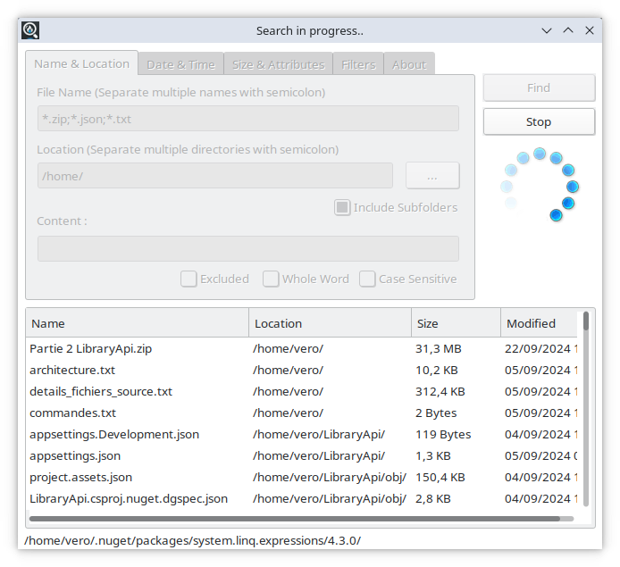

 

# FileFind

**FileFind** is an advanced file search utility designed to efficiently locate files and directories based on a wide range of criteria, including name patterns, size, attributes, content, and timestamps.

🚀 Lightweight, intuitive, and blazing fast!


---

## Features

- **Comprehensive Search Options:**
  - Search by name patterns with wildcards (`*`, `?`).
  - Filter by file size, type, or attributes (e.g., hidden, read-only).
  - Specify date ranges for creation, modification, or last access times.

- **Content Search:**
  - Locate files containing specific phrases or words.
  - Case-sensitive and whole-word matching.
  - Negate results to exclude specific content.

- **Advanced Filters:**
  - Exclude or include specific file types or directories.
  - Recursive search in subdirectories.

- **Cross-Platform Compatibility:**
  - Runs seamlessly on **Windows**, **Linux**, and **macOS**.

- **Intuitive User Interface:**
  - Clean and organized tabs for easy navigation.
  - Real-time status updates with progress indicators.

---

## Installation

You can install **FileFind** via different methods depending on your platform.

### Precompiled Binaries
Download the latest release from the [Releases Page](https://github.com/NDXDeveloper/FileFind/releases).

- **Windows:** Download and run the `FileFind-Setup.exe` installer.
- **Linux:** Install the `.deb` or `.rpm` package using your package manager.
- **macOS:** Use the `.dmg` file to install FileFind.

See [INSTALL.md](INSTALL.md) for detailed instructions.

### From Source
Clone the repository and build **FileFind** using the **Free Pascal Compiler (FPC)** or **Lazarus IDE**:

```bash
git clone https://github.com/NDXDeveloper/FileFind.git
cd FileFind
fpc filefind.lpr
```

---

## Usage

1. Launch **FileFind** from your applications menu or terminal.
2. Select a folder to search in.
3. Define your criteria:
   - File name pattern (`*.txt`, `report?.docx`, etc.).
   - Content search phrase (optional).
   - Filters for size, date, and attributes.
4. Click **Start Search** and watch results appear in real-time.
5. Double-click results to open files or their locations.

For advanced tips, check out the [USAGE.md](USAGE.md) file.

---

## Screenshots

### Search Interface




---

## Contributing

We welcome contributions from the community! Here's how you can help:

1. **Report Issues:** Found a bug? Open an issue [here](https://github.com/NDXDeveloper/FileFind/issues).
2. **Submit Features:** Suggest new features or enhancements.
3. **Fork and Code:** Clone the repository, make your changes, and submit a pull request.

---

## License

This project is licensed under the **GNU General Public License v3 (GPLv3)**. For details, see the [LICENSE](LICENSE) file.

---

## Support

Have questions or need help? Reach out via:
- [GitHub Issues](https://github.com/NDXDeveloper/FileFind/issues)
- [SoftForges Website](https://SoftForges.com)

---

## Acknowledgments

Special thanks to:
- The **Free Pascal** and **Lazarus IDE** communities for their incredible tools.
- Open-source contributors who make projects like this possible.

---

Ready to make your file searches faster and easier? Try **FileFind** today! 🚀

